CityCare Medical Centre Management System  Documentation

README File – Setup Steps

CityCare Medical Centre Management System is a Laravel-based hospital management system developed to improve patient handling, appointment scheduling, doctor coordination, treatment records, and payment tracking.

To run the project successfully, the system requires PHP 8 or above, Laravel 12, Composer, MySQL, XAMPP, Node.js, and NPM.

The first step is to place the project folder inside the XAMPP htdocs directory. For example:

C:\xampp\htdocs\citycare_medical_centre

After that, open the project using Visual Studio Code or Command Prompt and navigate into the project folder.

Install all Laravel dependencies using:

composer install

Install frontend dependencies using:

npm install
npm run dev

Next, copy the ".env.example" file and rename it to ".env", then generate the Laravel application key using:

php artisan key:generate

Create a new database in phpMyAdmin called:

citycare_medical_centre

Then update the ".env" file with the database details:

DB_DATABASE=citycare_medical_centre
DB_USERNAME=root
DB_PASSWORD=

Run database migrations using:

php artisan migrate

Finally, start the Laravel development server using:

php artisan serve

The system will run on:

http://127.0.0.1:8000

Explanation of Major Features

The system contains secure authentication and role-based access control. Different users log in according to their responsibilities, including Admin, Doctor, Receptionist, Cashier, and Patient. Each role only accesses the allowed modules.

The Patient Management feature stores full patient records such as patient number, names, gender, blood group, contact details, emergency contacts, registration date, and account linking for login access.

The Doctor Management feature stores doctor information including department, specialization, consultation fee, phone number, and doctor login account linking.

The Appointment Management feature allows receptionists to book appointments, update appointment details, and cancel appointments when necessary. This reduces double booking and improves scheduling.

The Consultation Notes and Treatment feature allows doctors to access patient information, record consultation notes, update treatment history, and monitor patient progress.

The Payment Management feature helps cashiers record payments, track payment status, monitor revenue, and generate billing summaries for management.

The Admin Dashboard provides full hospital monitoring through statistics, reports, revenue summaries, patient distribution charts, appointment reports, and recent activity tracking.

The Patient Dashboard allows patients to log in and view their personal profile, upcoming appointments, visit history, and payment status.

The Forgot Password and Email Verification feature improves security by allowing users to receive reset codes through email and safely update passwords.

Screenshots / Brief Description of System Modules

1. Login and Authentication Module
This module allows users to register, log in, verify OTP, and reset forgotten passwords. It ensures secure access to the hospital system.
Screenshot: Login page and Forgot Password page.
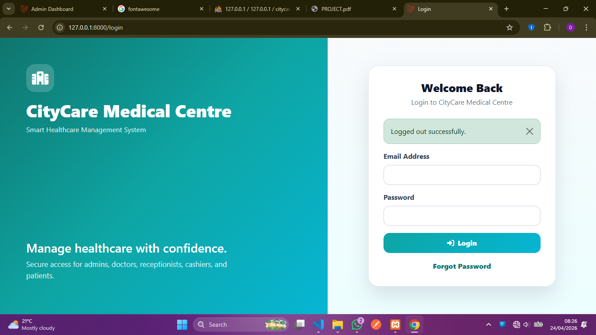
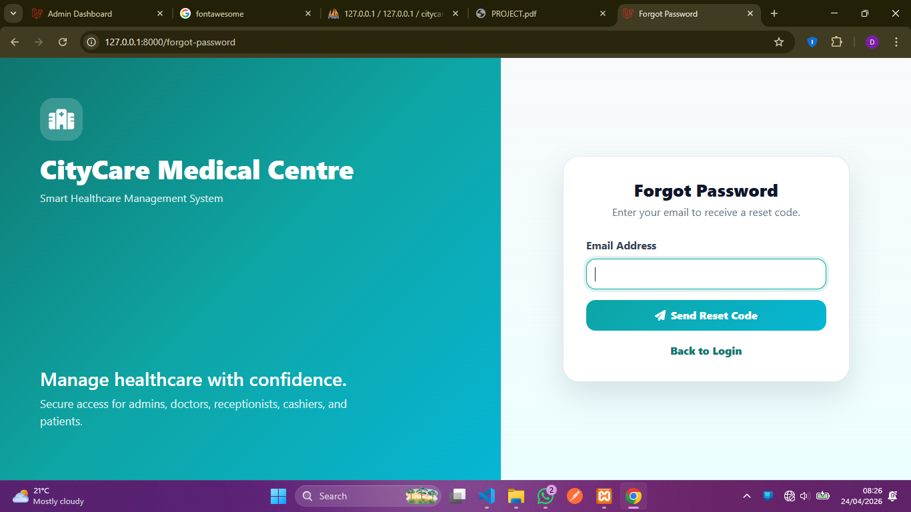
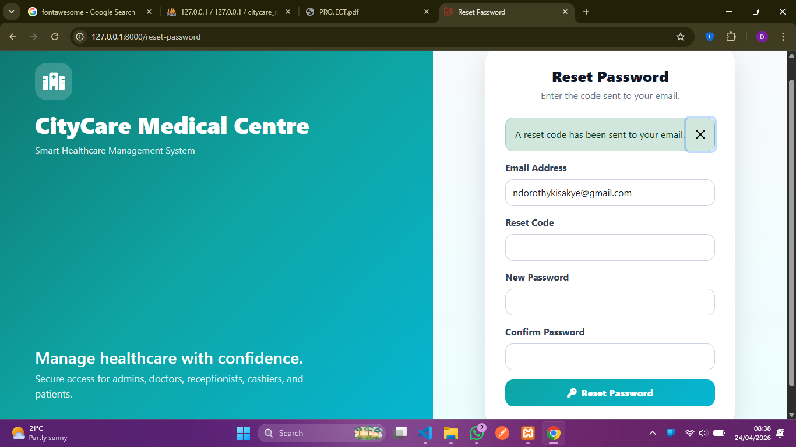

2. Dashboard Module
This module displays role-based dashboards.
a) Admin dashboard shows patients, doctors, appointments, payments, reports, graphs, and full system monitoring.
b) Doctor dashboard shows appointments, patient information, consultation notes, and treatment history.
c) Receptionist dashboard shows appointment booking, updates, and cancellations.
d) Cashier dashboard shows payment records, revenue tracking, and payment summaries.
e) Patient dashboard shows profile details, appointments, visit history, and payment status.
Screenshot:Admin dashboard with charts and cards.
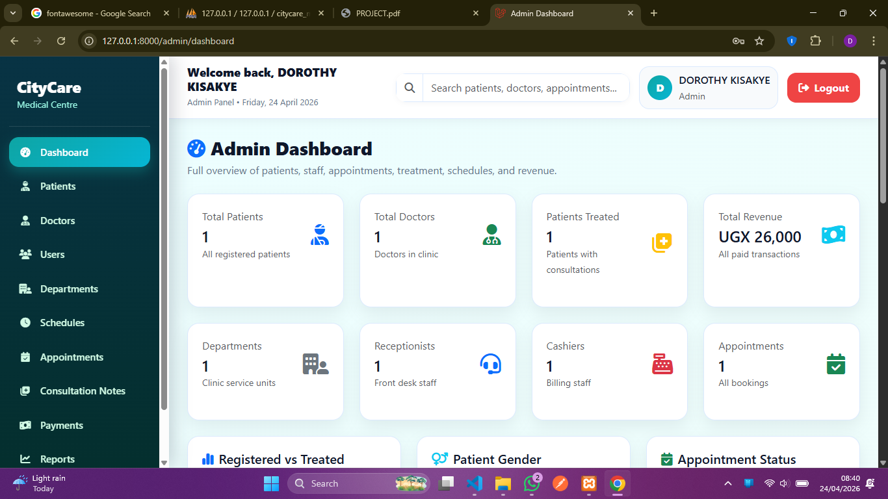
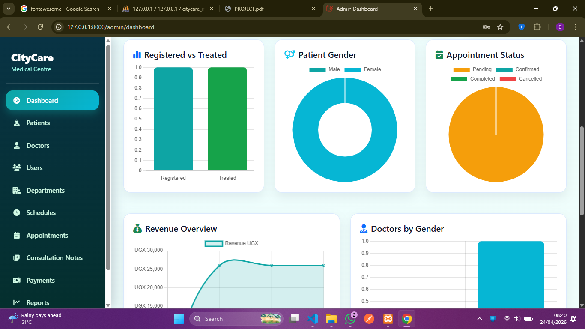
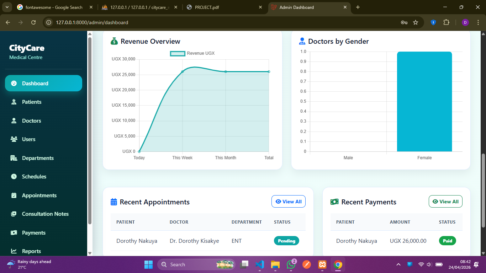

3. Patients Module
This module handles patient registration, updates, viewing patient details, and linking patients to login accounts.
Screenshot: Patient registration form.
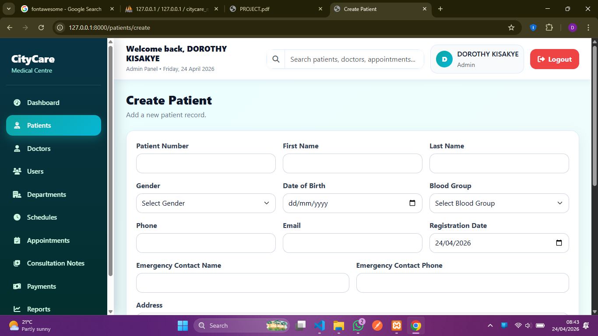
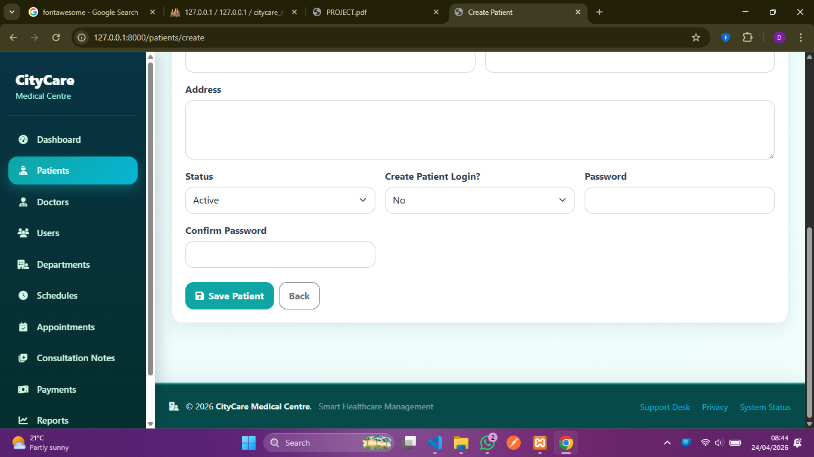

4. Doctors Module
This module manages doctor records including department assignment and professional details.
Screenshot: Doctor details page.
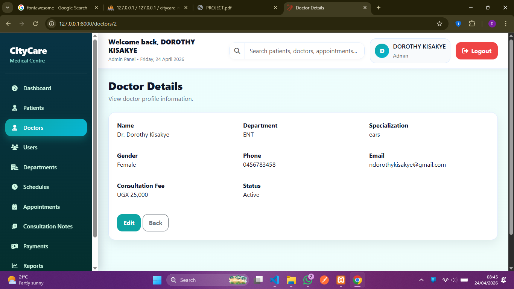

5. Appointments Module
This module supports appointment booking, updating schedules, and cancellation of appointments.
Screenshot: Appointments page.
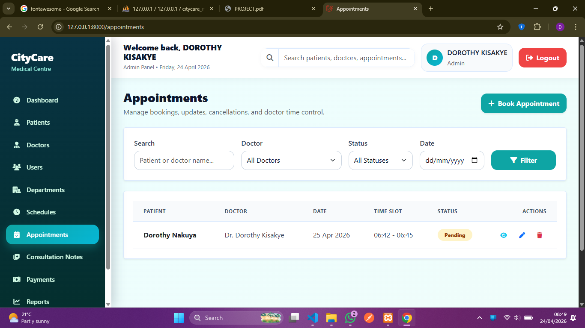

6. Payments Module
This module records all patient payments and tracks payment completion.
Screenshot: Payments page.
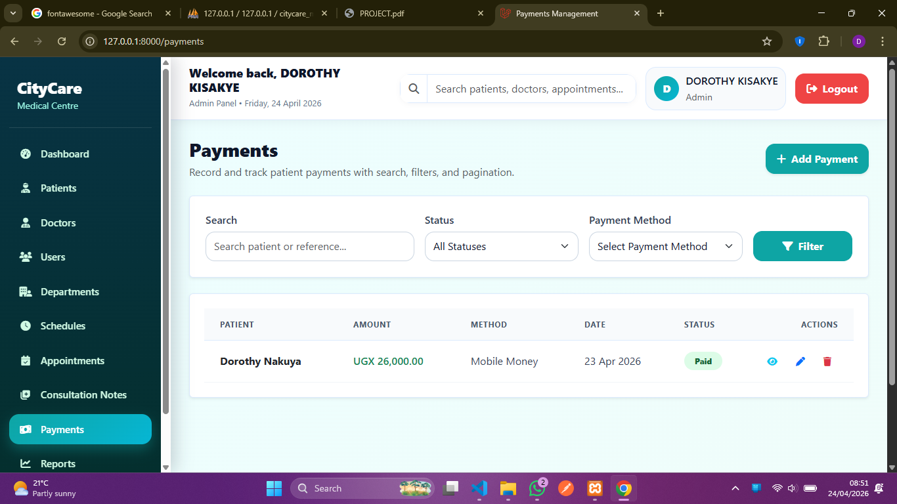

7. Users Module
This module is used by admin to manage staff accounts, roles, and permissions.
Screenshot: Users management page.
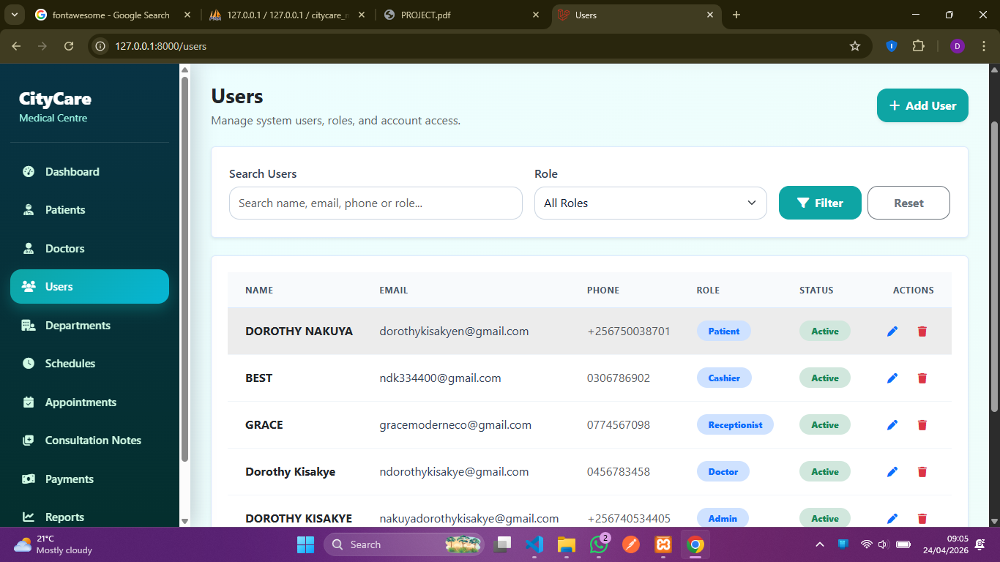

8. Reports Module
This module generates reports and summaries for hospital management and decision-making.
Screenshot:Reports page.
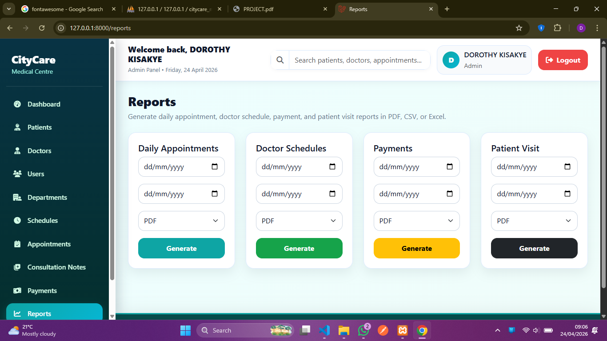

9. Activity logs
This module shows all tracks of users in the system
Screenshot:Activity logs page
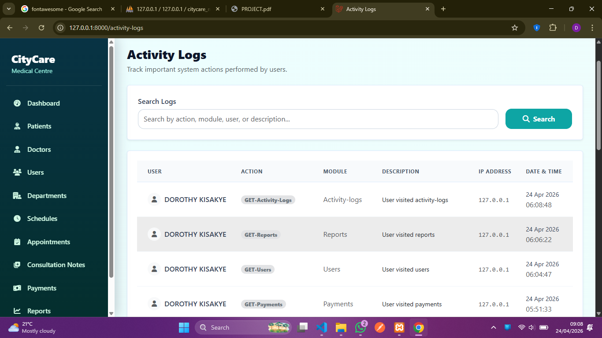

10. Consultation notes
This module manages consulatation notes, by creating, editing and viewing details and deleting consultation notes.
Screenshot: Consultatiom notes detail page
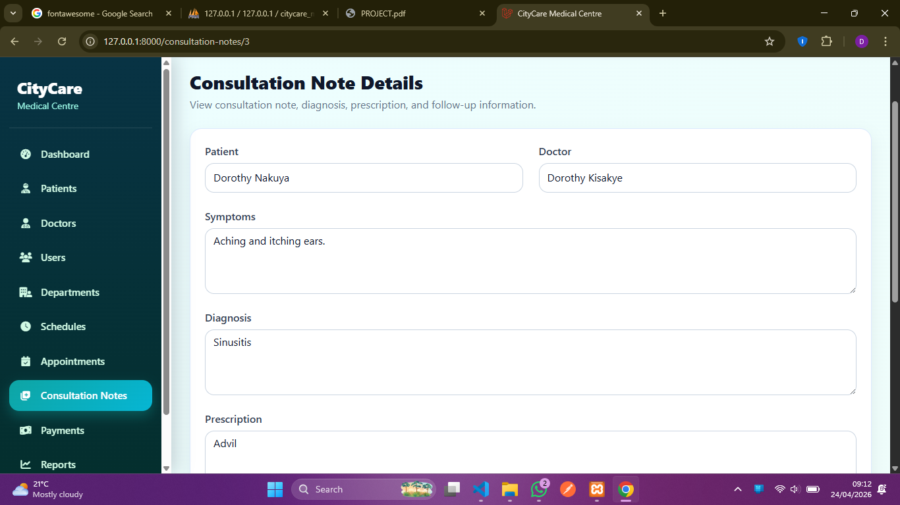
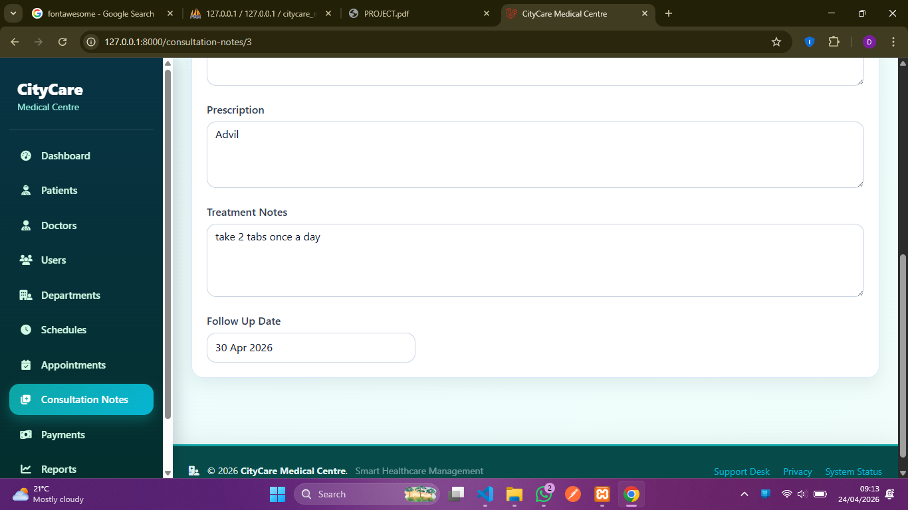

11. Schedules
This module manages schedules, they can be edited, created and deleted.
Screenshot: Schedules page
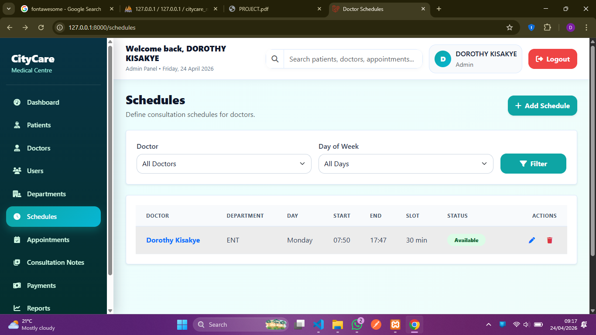

12. Department module
This manages the departments though creation of a new department, editing, giving its status and deleting.
Screenshot: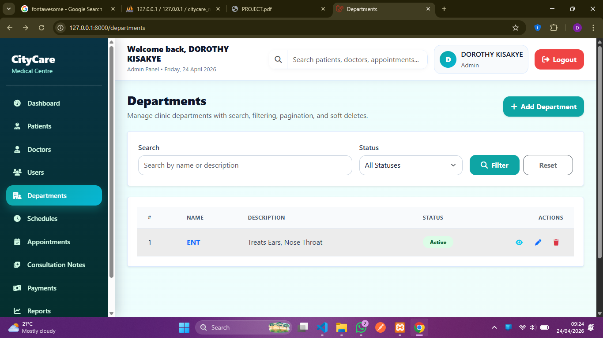

Conclusion
The CityCare Medical Centre Management System improves healthcare service delivery by replacing manual processes with a professional digital platform. It improves appointment scheduling, patient record management, treatment tracking, payment monitoring, and hospital administration efficiency.